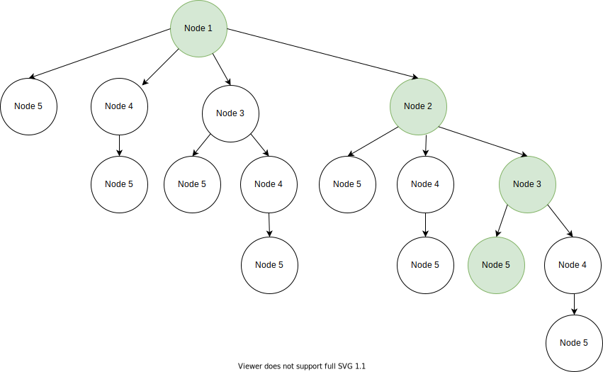

# Informe Practica 2

Práctica 2 de Algorítmica y Complejidad

# Greddy
El Greddy es un algoritmo que busca el coste minimo actual independientemente si da una solución mínima o correcta. En este caso sobre el problema de la construción de un aqueducto cuando queramos construir un arco tendremos que precalcular los costes para todos los tamaños de arco desde un mismo punto de inicio, y elegir el de menor coste, en la mayoria de casos el menor coste sera el de un arco entre 2 puntos, a no ser que la altura máxima sea muy elevada. Según el camino que elijamos podemos llegar a un punto en el que ya no podemos poner ningun arco mas ya que hemos elejido el minimo siempre y nos lleva a un camino imposible, por eso en algunas ocasiones el resultado nos da imposible, aunque en realidad hay un resultado correcto.
## Greddy Recursivo
Uso:

    $ ./greedy_recursive.py <fitxer entrada>
### Costes Teóricos Greddy Recursivo
Coste Teorico del Greddy: El coste dependerá de cual sea el camino a seguir, como en la mayoria de casos hacemos arcos de 2 puntos, es decir, un solo salto, entonces el coste sera de O(n·log(n))

Coste mínimo: O(n)

Coste máximo: O(n·log(n))

numero puntos = 5

### Pseudocódigo y Costes Prácticos Greddy Recursivo

Los costes prácticos del greedy:
En el mejor de los casos el coste será de O(n) ya que al empezar en el primer punto, tras calcular el coste de todos los tamaños de arco, si la mejor opción es poner un solo arco hasta el final, entonces no tenemos que seguir haciendo llamadas recursivas.

En el peor de los casos el coste seria de O(n·log(n)) sería el caso en el que tras calcular todos los costes desde un punto de inicio, el de menor coste es un arco que va de un punto al siguiente, y taly como avanzamos, cada vez hay menos posibilidades a comprobar.

    greedy_recursive(numero_puntos, pos_x, pos_y)
        coste_total = 0
        if numero_puntos > 1    # para saber si estamos en el ultimo punto 
            x = 1
            menor_coste = calculate_cost_greedy(pos_x, pos_y, 0, x)    # desde la posición 0 hasta la x porque cuando llamamos a la función recursiva recortamos el array

            while x < len(pos_x)
                x + 1
                aux = calculate_cost_greedy(pos_x, pos_y, 0, x) 
                if  aux == "impossible"                                             # si da impossible no nos interesa comprar con el resultat del menor coste
                    continue
                if aux < menor_coste
                    x_menor_coste = x                                               # x_menor_coste indica que posición del array ha sido el de menor coste para poder recortarlo
                    menor_coste = aux
            
            if menor_coste != "Impossible"
                result_temp = greedy_recursive(numero_puntos - x_menor_coste,       # llamamos a la recursividad recortando el array numero_puntos donde ha sido el x de menor coste
                                                pos_x[x_menor_coste:],              # hacemos lo mismo con los arrays de posición recordandolo igual numero_puntos
                                                pos_y[x_menor_coste:])                                  

                if result_temp == "Impossible"
                    menor_coste = "Impossible"
                else
                    coste_total = menor_coste + result_temp
        else
            return coste_total

# Análisis de costes

Grafico de Costes Practicos - Greedy Recursivo

# Diseño
Esquema del algotirmo - Greedy Recursivo

# Implementación

greedy_iterative.py

greedy_recursive.py

# BackTraking
El Backtraking es un algorithmo de fuerza bruta que busca un resultado posible, si llega un a un punto en el que no puede continuar, vuelve al punto anterior y elije otro camino. En este caso al construir un aqueducto nos pide que demos el mejor coste de construción de todo el aqueducto, para eso tenemos que encontrar todos los caminos posibled para crear un aqueducto y elegir el de minimo coste.
## BackTraking Recursivo
Uso:

    $ ./backtracking_recursive.py <fitxer entrada>
### Costes Teóricos BackTraking Recursivo

En el mejor y peor de los casos el coste sería de O(n*n), ya que comprueba todas las soluciones possibles independientemente si la primera es la mejor, necesita todas las posibilidades para determinar la de menor coste.

### Pseudocódigo y Costes Prácticos BackTraking Recursivo

    def backtracking_recursive(n_points, pos_x, pos_y):

        # si hay varios punts entrar al if para hacer todas las combinación con los diferentes puntos

        if numero_de_puntos > 2        # si no hay mas de 2 puntos solo tienes que calcular un salto simple
            i=1
            while i < numero_de_puntos - 1
                pos_x_a = pos_x [:i +1]         # recortamos el array 
                pos_x_y = pos_y [:i +1]         # recortamos el array 
                
                aux_a = calculate_cost( pos_x_a, pos_y_a, 0, -1 ) 
                pos_x_b = pos_x[i:]         # Array con las posiciones desde la i hasta la final
                pos_y_b = pos_y[i:]

                aux_b = backtracking_recursive(n_points - i, pos_x_b, pos_y_b) # llamamos la función recursiva para continuar probando caminos con el resto de puntos

                # si alguno de los calcualos da impossible no hace falta continuar ya que no es un camino possible

                if aux_a == "impossible" or aux_b == "impossible":  
                    coste[i] = "impossible"

                else:   # en caso contrario sumamos una possible solución 
                    coste[i] = aux_a + aux_b 

        # calculamos la posibilidad de un solo arco desde pos_x hasta al final

        coste[n_points] = calcular.calculate_cost(pos_x, pos_y, 0, -1)

        # si todos los resultados obtenidos son impossibl hacemos retunr impossible

        if all_impossible:
            return "impossible"

        # cojemos el resultado que sea possible de menor coste
        for k in coste:
            if coste[i] != "impossible":
                if coste[i] < result_:
                    result_ = coste[i]

        return result

# Análisis de costes

Grafico de Costes Practicos - Backtracking Recursivo

# Diseño
Esquema del algotirmo - Backtracking Recursivo

# Implementación

backtracking_recuersive.py

backtracking_iterative.py

# Dynamic_Progaming
El Dynamic Progaming es un algorithmo muy parecido al BackTraking pero en este caso guarda los costes calculados de los puntes para reutilizarlo y no volver a calcular todos los costes posibles. En este caso al construir un aqueducto nos pide que demos el mejor coste de construción de todo el aqueducto, para eso tenemos que encontrar todos los caminos posibles para crear un aqueducto y elegir el de mínimo coste.
## Dynamic_Progaming Recursivo
Uso:

    $ ./dynamic_Progaming_recursive.py <fitxer entrada>
### Costes Teóricos Dynamic_Progaming Recursivo

En el mejor y peor de los casos el coste sería de O(n*n), ya que comprueba todas las soluciones possibles independientemente si la primera es la mejor, necesita todas las posibilidades para determinar la de menor coste.

El coste real será algo menor que el del backtracking, ya que hacemos muchas menos llamadas a la función de calcular coste. 

### Pseudocódigo y Costes Prácticos Dynamic_Progaming Recursivo

    def backtracking_recursive(n_points, pos_x, pos_y, pos_inicial, costes_calculados):

        # si hay varios punts entrar al if para hacer todas las combinación con los diferentes puntos

        if numero_de_puntos > 2        # si no hay mas de 2 puntos solo tienes que calcular un salto simple
            i=1
            while i < numero_de_puntos - 1
                pos_x_a = pos_x [:i +1]         # recortamos el array 
                pos_x_y = pos_y [:i +1]         # recortamos el array 
                
                # si en la posición [x][y] es diferente de zero es que hay algun valor calculado entonces no tenemos que volver a calcularlo solo lo cojemos

                if costes_calculados[x][y] != 0     
                    aux_a = costes_calculados[x][y]

                # en caso contrario hay que calcularlo por primera vez y lo guardamos en el array de calculados

                else
                    aux_a = calculate_cost( pos_x_a, pos_y_a, 0, -1 ) 
                    costes_calculados[x][y] = aux_a

                pos_x_b = pos_x[i:]         # Array con las posiciones desde la i hasta la final
                pos_y_b = pos_y[i:]

                aux_b = backtracking_recursive(n_points - i, pos_x_b, pos_y_b) # llamamos la función recursiva para continuar probando caminos con el resto de puntos

                # si alguno de los calcualos da impossible no hace falta continuar ya que no es un camino possible

                if aux_a == "impossible" or aux_b == "impossible":  
                    coste[i] = "impossible"

                else:   # en caso contrario sumamos una possible solución 
                    coste[i] = aux_a + aux_b 

        # calculamos la posibilidad de un solo arco desde pos_x hasta al final

        coste[n_points] = calcular.calculate_cost(pos_x, pos_y, 0, -1)

        # si todos los resultados obtenidos son impossibl hacemos retunr impossible

        if all_impossible:
            return "impossible"

        # cojemos el resultado que sea possible de menor coste
        for k in coste:
            if coste[i] != "impossible":
                if coste[i] < result_:
                    result_ = coste[i]

        return result

# Análisis de costes

Grafico de Costes Practicos - Dynamic Progamming Recursivo

# Diseño
Esquema del algotirmo - Dynamic Progamming Recursivo

# Implementación

dynamic_progamming_recursive.py

dynamic_progamming_iterative.py

        

Dynamic Output Array
Aquí podemos ver como es el array de dimensiones n * n en el que guardamos los costes intermedios.

        enriquesubias@MacBook-Pro Practica2 % ./dynamic_programming_recursive.py aqueductes/secret-12.in
        3567
        [0, 361.0, 412.0, 440.0, 516.0, 520.0, 609.0, 837.0, 1181.0, 1293.0, 2165.0, 2648.0, 3724.0, 5516.0, 5633.0, 6253.0, 7044.0, 7193.0, 7605.0]
        [0, 0, 397.0, 344.0, 376.0, 328.0, 385.0, 372.0, 376.0, 336.0, 460.0, 369.0, 460.0, 528.0, 305.0, 340.0, 345.0, 305.0, 384.0]
        [0, 0, 0, 421.0, 388.0, 340.0, 393.0, 389.0, 536.0, 396.0, 512.0, 633.0, 585.0, 908.0, 529.0, 349.0, 401.0, 340.0, 389.0]
        [0, 0, 0, 0, 493.0, 360.0, 409.0, 429.0, 565.0, 588.0, 716.0, 705.0, 1089.0, 1173.0, 929.0, 685.0, 420.0, 404.0, 444.0]
        [0, 0, 0, 0, 0, 493.0, 433.0, 477.0, 629.0, 621.0, 1100.0, 969.0, 1201.0, 2013.0, 1204.0, 1165.0, 896.0, 425.0, 524.0]
        [0, 0, 0, 0, 0, 0, 580.0, 533.0, 701.0, 693.0, 1157.0, 1433.0, 1585.0, 2181.0, 2068.0, 1480.0, 1476.0, 929.0, 549.0]
        [0, 0, 0, 0, 0, 0, 0, 792.0, 781.0, 773.0, 1277.0, 1500.0, 2209.0, 2733.0, 2240.0, 2440.0, 1841.0, 1529.0, 1109.0]
        [0, 0, 0, 0, 0, 0, 0, 0, 1124.0, 861.0, 1405.0, 1640.0, 2296.0, 3581.0, 2804.0, 2628.0, 2921.0, 1904.0, 1749.0]
        [0, 0, 0, 0, 0, 0, 0, 0, 0, 1232.0, 1541.0, 1788.0, 2476.0, 3696.0, 3668.0, 3240.0, 3129.0, 3008.0, 2144.0]
        [0, 0, 0, 0, 0, 0, 0, 0, 0, 0, 2080.0, 1944.0, 2664.0, 3932.0, 3785.0, 4168.0, 3801.0, 3220.0, 3296.0]
        [0, 0, 0, 0, 0, 0, 0, 0, 0, 0, 0, 2553.0, 2860.0, 4176.0, 4025.0, 4293.0, 4809.0, 3904.0, 3516.0]
        [0, 0, 0, 0, 0, 0, 0, 0, 0, 0, 0, 0, 3609.0, 4428.0, 4273.0, 4549.0, 4944.0, 4928.0, 4224.0]
        [0, 0, 0, 0, 0, 0, 0, 0, 0, 0, 0, 0, 0, 5373.0, 4529.0, 4813.0, 5220.0, 5065.0, 5280.0]
        [0, 0, 0, 0, 0, 0, 0, 0, 0, 0, 0, 0, 0, 0, 5488.0, 5085.0, 5504.0, 5345.0, 5421.0]
        [0, 0, 0, 0, 0, 0, 0, 0, 0, 0, 0, 0, 0, 0, 0, 6100.0, 5796.0, 5633.0, 5709.0]
        [0, 0, 0, 0, 0, 0, 0, 0, 0, 0, 0, 0, 0, 0, 0, 0, 6881.0, 5929.0, 6005.0]
        [0, 0, 0, 0, 0, 0, 0, 0, 0, 0, 0, 0, 0, 0, 0, 0, 0, 7028.0, 6309.0]
        [0, 0, 0, 0, 0, 0, 0, 0, 0, 0, 0, 0, 0, 0, 0, 0, 0, 0, 7436.0]
        [0, 0, 0, 0, 0, 0, 0, 0, 0, 0, 0, 0, 0, 0, 0, 0, 0, 0, 0]
